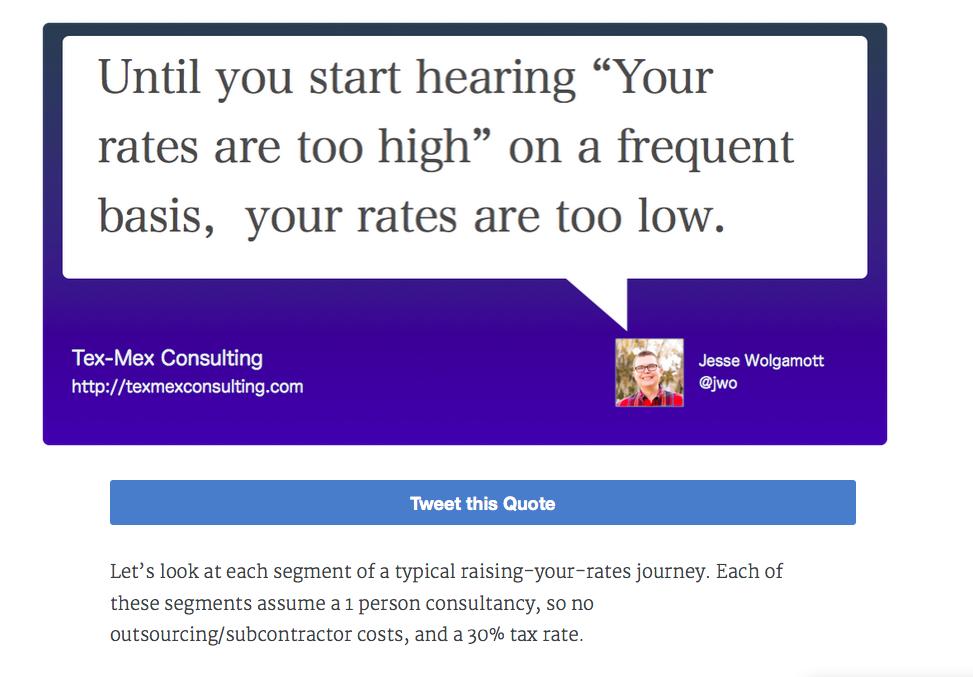

# Twitter Image Quote

A way to simply tweet out a quote (with an image) to your blog post, AND create
a URL to tweet out the same.

## example:

## Article URL
http://blog.texmexconsulting.com/how-much-money-can-you-really-make-as-a-freelancer/

### ScreenShot

### Example URL
https://twitter.com/intent/tweet?text=Until+you+hear+%22Your+rates+are+too+high%22+on+a+frequent+basis%2C+your+rates+are+too+low+http://blog.texmexconsulting.com/how-much-money-can-you-really-make-as-a-freelancer/+http://pic.twitter.com/Dg4dRfLKfT

## How to Use

1. Clone locally
2. `cp .env.sample .env`
3. Edit the .env with values from Twitter Application (both the application's
   secrets and your oauth secrets). Recommended way to get these: the `t` gem
   authorize process. Follow the instructions, and find the values in ~/.trc
4. `ruby twitter-image-quote` and answer the questions

You'll need:

* The quote (100 characters)
* The article URL
* The image file path

## Copyright

